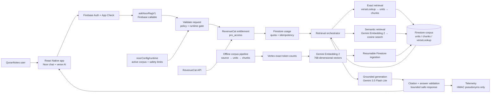

# QuranNotes Noor RAG: architecture and proof

This document describes the live Noor backend as verified on 2026-08-11 UTC. It is an educational map of the system, not a claim that the tafsir source rights have been independently cleared.

## The one-sentence version

The app sends an authenticated question to a Firebase callable. The backend checks access and quota, finds relevant tafsir passages in Firestore using exact verse lookup or vector search, sends only those passages to Gemini, validates the structured answer and citations, and returns the answer to the app.

## Interactive diagram

Open [`qurannotes-noor-rag.drawio`](./qurannotes-noor-rag.drawio) in draw.io for an editable diagram. The Mermaid version below renders interactively in Markdown viewers that support Mermaid.



## What each part does

### 1. The app

The mobile app is the client. It sends a question, selected verse/source, history, and a request ID. It does not contain the Gemini key, perform vector search, or decide whether a user is entitled.

Relevant backend-facing entry points include `functions/src/noor-rag/callable.ts` and the generated request/answer contract in `functions/src/noor-rag/generatedContract.ts`.

### 2. The callable boundary

`functions/src/noor-rag/callable.ts` exposes `askNoorRagV1` as a Firebase Gen 2 callable. It is deployed in `us-central1`, with App Check enforcement, Firebase authentication, 512 MiB memory, 30-second timeout, max 10 instances, and concurrency 20.

`functions/src/noor-rag/handler.ts` owns the request pipeline. It rejects malformed, unauthenticated, disabled, quota-exceeded, and unsafe requests before model work.

### 3. Entitlement and quota

`functions/src/noor-rag/entitlement.ts` verifies RevenueCat `pro_access`. `functions/src/noor-rag/usage.ts` provides transactional daily/RPM limits, idempotent replay, and safe finalization. This keeps access and billing decisions on the server.

### 4. The corpus

The corpus is the prepared knowledge collection used by RAG. It is not a new AI model and it is not the database itself. It is the source material after it has been normalized, grouped into canonical units, split into bounded chunks, counted, hashed, and prepared for embedding.

The Firestore database stores the deployed copy of that corpus:

- `corpora/{version}/units` — canonical contiguous tafsir units.
- `corpora/{version}/chunks` — bounded text chunks plus 768-number embedding vectors.
- `corpora/{version}/verseLookup` — verse-to-unit/chunk routing records.
- `corpusManifests/{version}` — counts, model, hash, and ingestion status.

The current live version is `2026-08-10-v1`: 7,867 units, 9,248 chunks, 12,408 lookups, 0 failed chunks, and 0 failed writes.

### 5. Building and embedding the corpus

The offline pipeline is in `functions/scripts/noor-rag/build-corpus.ts` and `ingest-corpus.ts`, using the core logic in `functions/src/noor-rag/corpus.ts`.

It performs this sequence:

1. Read the committed Ibn Kathir and Al-Sa'di source records.
2. Group only contiguous, byte-identical records.
3. Split long units at sentence/whitespace boundaries.
4. Use exact Vertex token counts to split any chunk above the hard limit.
5. Embed each final chunk with Gemini Embedding 2 at dimension 768.
6. Write vectors and metadata to Firestore in resumable batches.
7. Write the complete manifest only after all writes succeed.

### 6. Retrieval at request time

`functions/src/noor-rag/retrieval.ts` has two deliberate paths:

- **Exact verse mode:** reads `verseLookup`, then fetches the canonical unit and chunks in the recorded order. It never calls the embedder or vector search.
- **Semantic chat mode:** formats the query once, embeds it once, searches the `chunks` collection group separately for each source with corpus-version and source filters, applies source thresholds, removes duplicate units, round-robins the sources, and enforces the total evidence character budget.

### 7. Grounded generation

`functions/src/noor-rag/generation.ts` sends only bounded, labeled evidence to Gemini 3.5 Flash Lite. The model is instructed to answer from the supplied evidence, return structured JSON, and use citation IDs. `functions/src/noor-rag/citations.ts` rejects unknown, duplicate, unused, and uncited evidence IDs.

### 8. Runtime control

`noorConfig/runtime` controls whether the backend is enabled, which corpus version is active, the model locks, source thresholds, and evidence budget. The live value is currently enabled and public with `activeCorpusVersion=2026-08-10-v1`.

## Proof links

These links require the Google account that owns the project:

- [Firestore runtime config](https://console.firebase.google.com/project/qurannotes-9f7a1/firestore/data/~2FnoorConfig~2Fruntime)
- [Firestore corpus manifest](https://console.firebase.google.com/project/qurannotes-9f7a1/firestore/data/~2FcorpusManifests~2F2026-08-10-v1)
- [Firestore vector indexes](https://console.cloud.google.com/firestore/indexes?project=qurannotes-9f7a1)
- [Cloud Function: askNoorRagV1](https://console.cloud.google.com/functions/details/us-central1/askNoorRagV1?project=qurannotes-9f7a1)
- [Callable endpoint](https://us-central1-qurannotes-9f7a1.cloudfunctions.net/askNoorRagV1)

The endpoint intentionally returns `401 Unauthenticated` without Firebase Auth and App Check credentials; that is the expected safe boundary response.

## Reproducible checks

From `functions/`:

```bash
npm test
npm run build
npm run build:scripts
npm run contract:check
npm run noor:corpus:validate -- --version=2026-08-10-v1
npm run noor:index:verify -- --project=qurannotes-9f7a1 --version=2026-08-10-v1
```

The last two commands require ADC credentials and read production state; they do not write corpus data.

## What is live versus what is not

Live: the Gen 2 callable, Firestore corpus, vectors, index, runtime switch, entitlement/quota/retrieval/generation code, and server-side safety controls.

Not completed by this document: App Store submission, local Xcode archive, TestFlight upload, physical-device QA, and merging the separate unfinished paywall/native release worktree. Those remain release operations, not RAG implementation.
